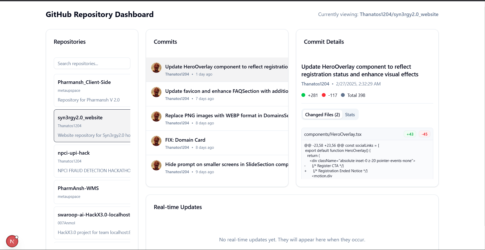

# GitHub Repository Monitor

A real-time dashboard for monitoring GitHub repositories and commit activities across projects you collaborate on.



## Overview

GitHub Repository Monitor is a Next.js-based application that provides real-time insights into GitHub repository activities. It allows developers, project managers, and team leads to track commit history, code changes, and repository updates in a centralized dashboard.

## Features

- **GitHub Authentication**: Secure login with your GitHub account
- **Repository Browser**: View and search all repositories you have access to
- **Commit History**: Track commits with detailed information
- **Real-time Updates**: See repository changes as they happen
- **File Diffs**: Analyze code changes with file comparisons
- **Activity Metrics**: Monitor additions, deletions, and modifications

## Use Cases

### Hackathons

This tool is particularly valuable during hackathons for several reasons:

1. **Real-time Progress Tracking**: Mentors and judges can monitor team progress without constant check-ins
2. **Contribution Transparency**: Clearly see individual contributions from each team member
3. **Code Review Efficiency**: Quickly review code changes without switching between repositories
4. **Milestone Monitoring**: Track if teams are meeting development milestones on schedule
5. **Presentation Preparation**: Use commit history to prepare for final presentations

### Other Use Cases

- **Educational Environments**: Teachers can monitor student assignments and provide timely feedback
- **Remote Teams**: Managers can track distributed team activities without disrupting workflow
- **Code Reviews**: Simplified interface for reviewing recent changes across repositories
- **Continuous Integration**: Monitor the impact of automated tests and deployment processes
- **Open Source Management**: Track contributor activity across multiple open source projects

## Setup Instructions

### Prerequisites

- Node.js 18.x or later
- npm or yarn
- GitHub account with repository access

### Installation

1. **Clone the repository**

```bash
git clone https://github.com/yourusername/github-repository-monitor.git
cd github-repository-monitor
```

2. **Install dependencies**

```bash
npm install
# or
yarn install
```

3. **Create a GitHub OAuth App**

   - Go to your GitHub account settings
   - Navigate to "Developer settings" > "OAuth Apps" > "New OAuth App"
   - Fill in the application details:
     - Application name: `GitHub Repository Monitor` (or your preferred name)
     - Homepage URL: `http://localhost:3000` (for local development)
     - Authorization callback URL: `http://localhost:3000/api/auth/callback/github`
   - Click "Register application"
   - Note your Client ID and generate a Client Secret

4. **Set up environment variables**

   Create a `.env.local` file in the project root with the following:

```
NEXTAUTH_URL=http://localhost:3000
NEXTAUTH_SECRET=your-random-secure-string
GITHUB_ID=your-client-id
GITHUB_SECRET=your-client-secret
```

### Running the Application

1. **Start the development server**

```bash
npm run dev
# or
yarn dev
```

2. **Access the application**

Open your browser and navigate to `http://localhost:3000`

### Setting up Webhooks (Optional, for real-time updates)

1. Go to your GitHub repository settings
2. Navigate to "Webhooks" > "Add webhook"
3. Set Payload URL to `http://your-public-url/api/webhooks/github`
4. Content type: `application/json`
5. Select "Send me everything" or choose specific events (at minimum: "Pushes")
6. Ensure your server is publicly accessible or use a tunneling service like ngrok for local development

## Deployment

### Vercel (Recommended)

1. Push your repository to GitHub
2. Import the project in Vercel
3. Configure environment variables
4. Deploy

### Other Platforms

The application can be deployed to any platform that supports Next.js applications:

1. Build the application:
```bash
npm run build
# or
yarn build
```

2. Start the production server:
```bash
npm start
# or
yarn start
```

## Technical Architecture

- **Frontend**: Next.js 15 with React
- **Authentication**: NextAuth.js with GitHub provider
- **Real-time Updates**: Socket.io
- **API Integration**: GitHub REST API
- **Styling**: Tailwind CSS / shadcn/ui

## Contributing

1. Fork the repository
2. Create your feature branch (`git checkout -b feature/amazing-feature`)
3. Commit your changes (`git commit -m 'Add some amazing feature'`)
4. Push to the branch (`git push origin feature/amazing-feature`)
5. Open a Pull Request

## License

Distributed under the MIT License. See `LICENSE` for more information.

## Contact

Your Name - [@TheReal_Bhargav](https://x.com/TheReal_Bhargav) - bhargav.dev.tools@gmail.com - [bento.me/bhargav-pandit](https://bento.me/bhargav-pandit) -[LinkedIn](https://www.linkedin.com/in/bhargavprasadpandit/)

Project Link: [https://github.com/Thanatos1204/Git-Monitor](https://github.com/Thanatos1204/Git-Monitor)

## Acknowledgements

- [Next.js](https://nextjs.org/)
- [NextAuth.js](https://next-auth.js.org/)
- [Socket.io](https://socket.io/)
- [GitHub API](https://docs.github.com/en/rest)
- [Tailwind CSS](https://tailwindcss.com/)
- [shadcn/ui](https://ui.shadcn.com/)